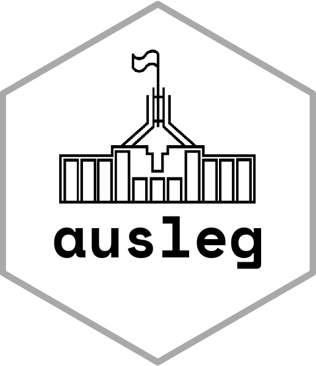

<!-- README.md is generated from README.Rmd. Please edit that file -->

```{r, include = FALSE}
knitr::opts_chunk$set(
  collapse = TRUE,
  comment = "#>",
  fig.path = "man/figures/README-",
  out.width = "100%"
)
```

# ausleg 

<!-- badges: start -->

<!-- badges: end -->

The goal of ausleg is to provide information on laws passed by the Australian Parliament since 1901. 

The functions: getPrincipalActs; getAmendingActs provide data up to November 2021. The data was scraped by myself from the [Federal Register of Legislation](https://www.legislation.gov.au)[^1] and is archived [here](https://www.github.com/palesl/Federal_Register_of_Legislation_Australia).

The functions: alrc_as_made; alrc_rels provide data up to April 2022. This data was scraped by the Australian Law Reform Centre[^2] in collaboration with the University of New South Wales and is stored on the [ALRC datahub website](https://www.alrc.gov.au/datahub/download-the-data/). These functions make use of the more comprehensive linkage data provided by the ALRC and should be preferred for those beginning new data projects.


[^1]: Redistributing under the FLR's Creative Commons 4.0 [copyright licence](https://www.legislation.gov.au/Content/Disclaimer#copyright). 

[^2]: Redistributing under the ALRC's Creative Commons 4.0 [copyright licence (see bottom of the page)](https://www.alrc.gov.au/datahub/download-the-data/). 

## Installation

You can install the development version of ausleg from [GitHub](https://github.com/) with:

``` r
# install.packages("devtools")
devtools::install_github("palesl/ausleg")
```

## Examples

These examples show some simple functionality of the package:

```{r example}
library(ausleg)


#	Get principal acts and metadata
getPrincipalActs()


# get relationships where one act repeals another 

alrc_relationship_data(rel_type = "repeals")

# get all pieces of regulation legislation

alrc_as_made(leg_type="Regulations")

```

## Use at own risk

I provide no warranty for errors either in the source material, or in my data collection. This is my best attempt at faithful redistribution of the material available on the Federal Register of Legislation. I would be grateful for any errors you find. Either get in touch or make a pull request!

## Image Attribution

Hex image icon: Canberra Parliament House by Anna Hatzisavas from [Noun Project](https://thenounproject.com/browse/icons/term/canberra-parliament-house/ "Canberra Parliament House Icons")
